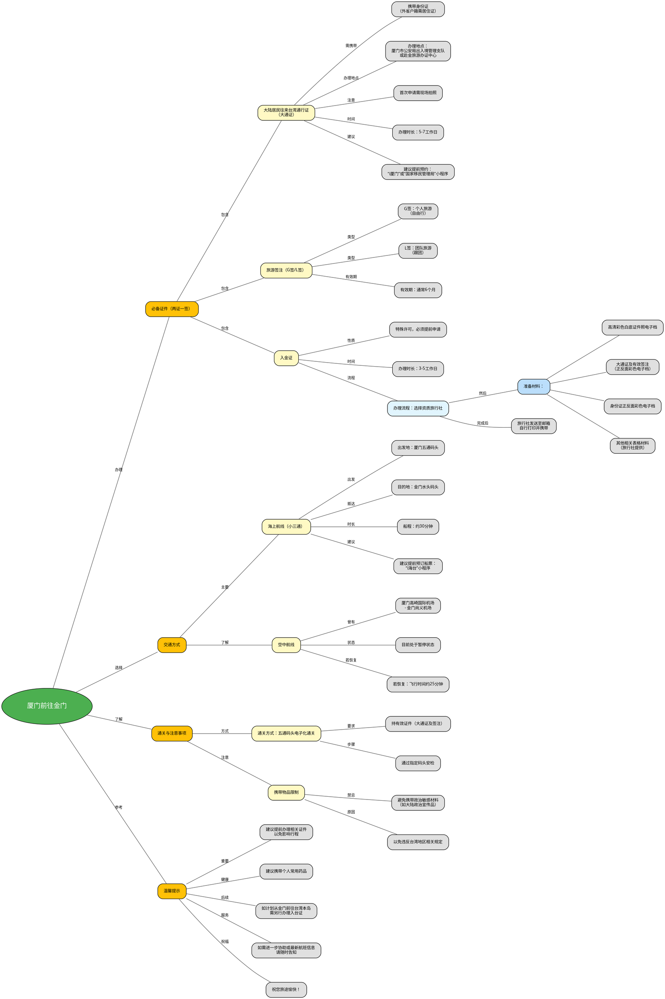

```dot
digraph mindmap {
    graph [
        layout = dot,
        rankdir = LR, // 从左到右布局
        nodesep = 0.8, // 节点间距
        ranksep = 1.5, // 级别间距
        fontname = "Sans-serif",
        fontsize = 12,
        newrank = true // 允许更灵活的排名布局
    ];
    node [
        shape = box,
        style = "filled,rounded",
        fillcolor = "#e0e0e0",
        fontname = "Sans-serif",
        fontsize = 10,
        margin = "0.2,0.1" // 调整节点内边距
    ];
    edge [
        arrowhead = none,
        fontname = "Sans-serif",
        fontsize = 9,
        color = "#555555"
    ];

    // 主节点
    "厦门前往金门" [
        shape = ellipse,
        style = "filled",
        fillcolor = "#4CAF50",
        fontcolor = "white",
        fontsize = 16,
        width = 3,
        height = 1.2
    ];

    // 分支
    "厦门前往金门" -> "必备证件（两证一签）" [label = "办理"];
    "厦门前往金门" -> "交通方式" [label = "选择"];
    "厦门前往金门" -> "通关与注意事项" [label = "了解"];
    "厦门前往金门" -> "温馨提示" [label = "参考"];

    // 必备证件
    "必备证件（两证一签）" [fillcolor = "#FFC107"];
    "必备证件（两证一签）" -> "大陆居民往来台湾通行证\n（大通证）" [label = "包含"];
    "大陆居民往来台湾通行证\n（大通证）" [fillcolor = "#FFF9C4"];
    "大陆居民往来台湾通行证\n（大通证）" -> "携带身份证\n（外省户籍需居住证）" [label = "需携带"];
    "大陆居民往来台湾通行证\n（大通证）" -> "办理地点：\n厦门市公安局出入境管理支队\n或赴金旅游办证中心" [label = "办理地点"];
    "大陆居民往来台湾通行证\n（大通证）" -> "首次申请需现场拍照" [label = "注意"];
    "大陆居民往来台湾通行证\n（大通证）" -> "办理时长：5-7工作日" [label = "时间"];
    "大陆居民往来台湾通行证\n（大通证）" -> "建议提前预约：\n“i厦门”或“国家移民管理局”小程序" [label = "建议"];

    "必备证件（两证一签）" -> "旅游签注（G签/L签）" [label = "包含"];
    "旅游签注（G签/L签）" [fillcolor = "#FFF9C4"];
    "旅游签注（G签/L签）" -> "G签：个人旅游\n（自由行）" [label = "类型"];
    "旅游签注（G签/L签）" -> "L签：团队旅游\n（跟团）" [label = "类型"];
    "旅游签注（G签/L签）" -> "有效期：通常6个月" [label = "有效期"];

    "必备证件（两证一签）" -> "入金证" [label = "包含"];
    "入金证" [fillcolor = "#FFF9C4"];
    "入金证" -> "特殊许可，必须提前申请" [label = "性质"];
    "入金证" -> "办理时长：3-5工作日" [label = "时间"];
    "入金证" -> "办理流程：选择资质旅行社" [label = "流程"];
    "办理流程：选择资质旅行社" [fillcolor = "#E1F5FE"];
    "办理流程：选择资质旅行社" -> "准备材料：" [label = "然后"];
    "准备材料：" [fillcolor = "#BBDEFB"];
    "准备材料：" -> "高清彩色白底证件照电子档";
    "准备材料：" -> "大通证及有效签注\n（正反面彩色电子档）";
    "准备材料：" -> "身份证正反面彩色电子档";
    "准备材料：" -> "其他相关表格材料\n（旅行社提供）";
    "办理流程：选择资质旅行社" -> "旅行社发送至邮箱\n自行打印并携带" [label = "完成后"];

    // 交通方式
    "交通方式" [fillcolor = "#FFC107"];
    "交通方式" -> "海上航线（小三通）" [label = "主要"];
    "海上航线（小三通）" [fillcolor = "#FFF9C4"];
    "海上航线（小三通）" -> "出发地：厦门五通码头" [label = "出发"];
    "海上航线（小三通）" -> "目的地：金门水头码头" [label = "抵达"];
    "海上航线（小三通）" -> "船程：约30分钟" [label = "时长"];
    "海上航线（小三通）" -> "建议提前预订船票：\n“i海台”小程序" [label = "建议"];

    "交通方式" -> "空中航线" [label = "了解"];
    "空中航线" [fillcolor = "#FFF9C4"];
    "空中航线" -> "厦门高崎国际机场\n- 金门尚义机场" [label = "曾有"];
    "空中航线" -> "目前处于暂停状态" [label = "状态"];
    "空中航线" -> "若恢复：飞行时间约25分钟" [label = "若恢复"];

    // 通关与注意事项
    "通关与注意事项" [fillcolor = "#FFC107"];
    "通关与注意事项" -> "通关方式：五通码头电子化通关" [label = "方式"];
    "通关方式：五通码头电子化通关" [fillcolor = "#FFF9C4"];
    "通关方式：五通码头电子化通关" -> "持有效证件（大通证及签注）" [label = "要求"];
    "通关方式：五通码头电子化通关" -> "通过指定码头安检" [label = "步骤"];

    "通关与注意事项" -> "携带物品限制" [label = "注意"];
    "携带物品限制" [fillcolor = "#FFF9C4"];
    "携带物品限制" -> "避免携带政治敏感材料\n（如大陆政治宣传品）" [label = "禁忌"];
    "携带物品限制" -> "以免违反台湾地区相关规定" [label = "原因"];

    // 温馨提示
    "温馨提示" [fillcolor = "#FFC107"];
    "温馨提示" -> "建议提前办理相关证件\n以免影响行程" [label = "重要"];
    "温馨提示" -> "建议携带个人常用药品" [label = "健康"];
    "温馨提示" -> "如计划从金门前往台湾本岛\n需另行办理入台证" [label = "后续"];
    "温馨提示" -> "如需进一步协助或最新航班信息\n请随时告知" [label = "服务"];
    "温馨提示" -> "祝您旅途愉快！" [label = "祝福"];
}
```

